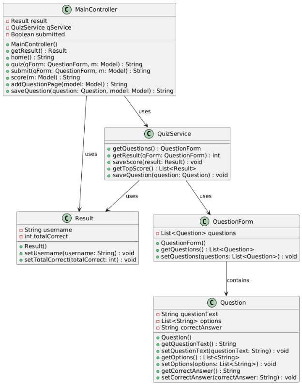

**مشروع التقييم البديل (٣٠٪)**

**مسار هندسة البرمجيات**

**Chill Quiz**

**اسم الطالب: جمال شرباتي**

**رقم هوية الطالب: 331759910**

**التاريخ : 17/5/2024**

**أولا: مقدمة عن المشروع**

مشروع يهدف الى عمل اختبار بسيط لاختبار قدرات البرمجة لدى المستخدم عن طريق 5 اسئلة لاختبار مستواه ثم تقييمه بنائاً عليها

**ثانياً: أهداف المشروع**

ايجاد طريقة تقييم سهلة الاستخدام في مجال البرمجة

مساعدة الطلاب و تشجيعهم على تثقيف انفسهم في هذا المجال

**ثالثاً : من المستهدف من المشروع**

طلاب او اناس مهتمين بمجال البرمجة يرغبون بفحص مستواهم بالأسئلة العامة في هذا التخصص

**رابعاً: ما هي التكنولوجيا المستخدمة بالمشروع**

- **HTML** - لغة ترميز تستخدم لبناء هيكل صفحات الويب.
- **CSS** - لغة تنسيق تستخدم لتصميم صفحات الويب.
- **Thymeleaf** - محرك قوالب Java لإنشاء صفحات ويب ديناميكية.
- **MySQL** - نظام إدارة قواعد بيانات علائقية مفتوح المصدر.
- **Spring Boot** - إطار عمل Java لتطوير تطبيقات الويب بسهولة وسرعة.
- **Enterprise Architect** - أداة احترافية لإنشاء نماذج UML وتحليلها.

**خامساً: ما هي الصفحات الرئيسية في مشروعك ؟** 

**MainController:**

**يتحكم بالروابط و طريقة التنقل بين صفحات الموقع وبالاشعارات التي تظهر للمستخدم**

package com.ChillQuiz.main.controller;

import com.ChillQuiz.main.model.Question;
import com.ChillQuiz.main.model.QuestionForm;
import com.ChillQuiz.main.model.Result;
import com.ChillQuiz.main.service.QuizService;
import org.springframework.beans.factory.annotation.Autowired;
import org.springframework.stereotype.Controller;
import org.springframework.ui.Model;
import org.springframework.web.bind.annotation.GetMapping;
import org.springframework.web.bind.annotation.ModelAttribute;
import org.springframework.web.bind.annotation.PostMapping;

@Controller
public class MainController {

`    `@Autowired
`    `Result result;

`    `@Autowired
`    `QuizService qService;

`    `Boolean submitted = false;

`    `@ModelAttribute("result")
`    `public Result getResult() {
`       `return result;
`    `}

`    `@GetMapping("/")
`    `public String home() {
`       `return "index.html";
`    `}

`    `@PostMapping("/quiz")
`    `public String quiz(@ModelAttribute QuestionForm qForm, Model m) {
`       `submitted = false;
`       `result.setUsername("User");
`       `QuestionForm questions = qService.getQuestions();
`       `m.addAttribute("qForm", questions);
`       `return "quiz.html";
`    `}

`    `@PostMapping("/submit")
`    `public String submit(@ModelAttribute QuestionForm qForm, Model m) {
`       `if (!submitted) {
`          `result.setTotalCorrect(qService.getResult(qForm));
`          `qService.saveScore(result);
`          `submitted = true;
`       `}
`       `return "result.html";
`    `}

`    `@GetMapping("/score")
`    `public String score(Model m) {
`       `m.addAttribute("sList", qService.getTopScore());
`       `return "scoreboard.html";
`    `}

`    `// Handle displaying the add question page
`    `@GetMapping("/addQ")
`    `public String addQuestionPage(Model model) {
`       `model.addAttribute("question", new Question());
`       `return "addq.html"; // This should match the Thymeleaf file name
`    `}

`    `// Handle saving the question
`    `@PostMapping("/saveQuestion")
`    `public String saveQuestion(@ModelAttribute Question question, Model model) {
`       `qService.saveQuestion(question);
`       `return "redirect:/";
`    `}
}

**Question :**

**يحدد صفات الأسئلة التي يتم عرضها في الأختبار و يحدد الاجابات المتاحة و الاجابة الصحيحة**

package com.ChillQuiz.main.model;

import javax.persistence.Entity;
import javax.persistence.GeneratedValue;
import javax.persistence.GenerationType;
import javax.persistence.Id;
import javax.persistence.Table;
import org.springframework.stereotype.Component;

@Component
@Entity
@Table(name = "questions")
public class Question {

`    `@Id
`    `@GeneratedValue(strategy = GenerationType.*IDENTITY*)
`    `private int quesId;
`    `private String title;
`    `private String optionA;
`    `private String optionB;
`    `private String optionC;
`    `private int ans;
`    `private int chose;

`    `public Question() {
`       `super();
`    `}

`    `public Question(int quesId, String title, String optionA, String optionB, String optionC, int ans, int chose) {
`       `super();
`       `this.quesId = quesId;
`       `this.title = title;
`       `this.optionA = optionA;
`       `this.optionB = optionB;
`       `this.optionC = optionC;
`       `this.ans = ans;
`       `this.chose = chose;
`    `}

`    `public int getQuesId() {
`       `return quesId;
`    `}

`    `public void setQuesId(int quesId) {
`       `this.quesId = quesId;
`    `}

`    `public String getTitle() {
`       `return title;
`    `}

`    `public void setTitle(String title) {
`       `this.title = title;
`    `}

`    `public String getOptionA() {
`       `return optionA;
`    `}

`    `public void setOptionA(String optionA) {
`       `this.optionA = optionA;
`    `}

`    `public String getOptionB() {
`       `return optionB;
`    `}

`    `public void setOptionB(String optionB) {
`       `this.optionB = optionB;
`    `}

`    `public String getOptionC() {
`       `return optionC;
`    `}

`    `public void setOptionC(String optionC) {
`       `this.optionC = optionC;
`    `}

`    `public int getAns() {
`       `return ans;
`    `}

`    `public void setAns(int ans) {
`       `this.ans = ans;
`    `}

`    `public int getChose() {
`       `return chose;
`    `}

`    `public void setChose(int choosed) {
`       `this.chose = choosed;
`    `}

`    `@Override
`    `public String toString() {
`       `return "Question [quesId=" + quesId + ", title=" + title + ", optionA=" + optionA + ", optionB=" + optionB + ", optionC=" + optionC + ", ans=" + ans + ", chose=" + chose + "]";
`    `}
}

**QuestionForm :**

**يعبر عن نموذج يحتوي على قائمة من الأسئلة لإدارة الأسئلة في المشروع**

package com.ChillQuiz.main.model;
import java.util.List;
import org.springframework.stereotype.Component;

@Component
public class QuestionForm {

`    `private List<Question> questions;

`    `public List<Question> getQuestions() {
`       `return questions;
`    `}

`    `public void setQuestions(List<Question> questions) {
`       `this.questions = questions;
`    `}
}

**Result :**

**يحدد صفات العلامة الخاصة بالمستخدم**

package com.ChillQuiz.main.model;

import javax.persistence.Entity;
import javax.persistence.GeneratedValue;
import javax.persistence.GenerationType;
import javax.persistence.Id;
import javax.persistence.Table;
import org.springframework.stereotype.Component;

@Component
@Entity
@Table(name = "results")
public class Result {

`    `@Id
`    `@GeneratedValue(strategy = GenerationType.*IDENTITY*)
`    `private int id;
`    `private String username;
`    `private int totalCorrect = 0;

`    `public Result() {
`       `super();
`    `}

`    `public Result(int id, String username, int totalCorrect) {
`       `super();
`       `this.id = id;
`       `this.username = username;
`       `this.totalCorrect = totalCorrect;
`    `}

`    `public int getId() {
`       `return id;
`    `}

`    `public void setId(int id) {
`       `this.id = id;
`    `}

`    `public String getUsername() {
`       `return username;
`    `}

`    `public void setUsername(String username) {
`       `this.username = username;
`    `}

`    `public int getTotalCorrect() {
`       `return totalCorrect;
`    `}

`    `public void setTotalCorrect(int totalCorrect) {
`       `this.totalCorrect = totalCorrect;
`    `}

}

**Question Repository :**

**الكود يعبر عن(repository) لإدارة عمليات الوصول إلى البيانات لكائن Question**

package com.ChillQuiz.main.repository;

import org.springframework.data.jpa.repository.JpaRepository;
import org.springframework.stereotype.Repository;

import com.ChillQuiz.main.model.Question;

@Repository
public interface QuestionRepo extends JpaRepository<Question, Integer> {

}

**Result Repository :**

**الكود يعبر عن(repository) لإدارة عمليات الوصول إلى البيانات لكائن Result**

package com.ChillQuiz.main.repository;

import org.springframework.data.jpa.repository.JpaRepository;
import org.springframework.stereotype.Repository;

import com.ChillQuiz.main.model.Result;

@Repository
public interface ResultRepo extends JpaRepository<Result, Integer> {

}

**Quiz Service :**

**يعمل الكلاس على تنسيق السؤال و جمع اسئلة عشوائية للاختبار و يعمل على حساب علامة المستخدم و حفظها في قائمة العلامات و تصنيف العلامات من الاعلى للأقل**

package com.ChillQuiz.main.service;

import java.io.BufferedWriter;
import java.io.FileWriter;
import java.io.IOException;
import java.util.ArrayList;
import java.util.List;
import java.util.Random;

import com.ChillQuiz.main.model.Question;
import com.ChillQuiz.main.model.QuestionForm;
import com.ChillQuiz.main.model.Result;
import com.ChillQuiz.main.repository.QuestionRepo;
import com.ChillQuiz.main.repository.ResultRepo;
import org.springframework.beans.factory.annotation.Autowired;
import org.springframework.data.domain.Sort;
import org.springframework.stereotype.Service;

@Service
public class QuizService {

`    `@Autowired
`    `private QuestionRepo qRepo;

`    `@Autowired
`    `private ResultRepo rRepo;

`    `// Fetch 5 random questions from the database
`    `public QuestionForm getQuestions() {
`       `List<Question> allQues = qRepo.findAll();
`       `List<Question> qList = new ArrayList<>();

`       `Random random = new Random();

`       `for (int i = 0; i < 5 && !allQues.isEmpty(); i++) {
`          `int rand = random.nextInt(allQues.size());
`          `qList.add(allQues.get(rand));
`          `allQues.remove(rand); // Remove to avoid duplicate questions in the same quiz
`       `}

`       `QuestionForm qForm = new QuestionForm();
`       `qForm.setQuestions(qList);

`       `return qForm;
`    `}

`    `// Compare user answers with correct answers
`    `public int getResult(QuestionForm qForm) {
`       `int correct = 0;
`       `for (Question q : qForm.getQuestions()) {
`          `if (q.getAns() == q.getChose()) {
`             `correct++;
`          `}
`       `}
`       `return correct;
`    `}

`    `// Save user quiz score
`    `public void saveScore(Result result) {
`       `Result saveResult = new Result();
`       `saveResult.setUsername(result.getUsername());
`       `saveResult.setTotalCorrect(result.getTotalCorrect());
`       `rRepo.save(saveResult);
`    `}

`    `// Fetch top scores sorted by highest total correct answers
`    `public List<Result> getTopScore() {
`       `return rRepo.findAll(Sort.*by*(Sort.Direction.*DESC*, "totalCorrect"));
`    `}

`    `// Save a new question to the database and append it to data.sql
`    `public void saveQuestion(Question question) {
`       `qRepo.save(question);  // Save question in database
`       `appendQuestionToSQLFile(question); // Append to data.sql
`    `}

`    `// Append the question to data.sql
`    `private void appendQuestionToSQLFile(Question question) {
`       `String sqlFilePath = "src/main/resources/data.sql"; // Path to data.sql
`       `String sqlInsert = String.*format*(
`             `"INSERT INTO questions (ques\_id, title, optionA, optionB, optionC, ans, chose) " +
`                   `"VALUES (NULL, '%s', '%s', '%s', '%s', %d, -1);\n",
`             `question.getTitle().replace("'", "''"),  // Escape single quotes
`             `question.getOptionA().replace("'", "''"),
`             `question.getOptionB().replace("'", "''"),
`             `question.getOptionC().replace("'", "''"),
`             `question.getAns()
`       `);

`       `try (BufferedWriter writer = new BufferedWriter(new FileWriter(sqlFilePath, true))) {
`          `writer.write(sqlInsert);
`       `} catch (IOException e) {
`          `e.printStackTrace();
`       `}
`    `}
}

**index.html :**

الصفحة الرئيسية التي يراها المستخدم عند زيارة الموقع ويضع فيها اسمه و يبدأ الاختبار

<!DOCTYPE html>
<html xmlns="http://www.w3.org/1999/xhtml"
`      `xmlns:th="http://www.thymeleaf.org">
<head>
`    `<link rel="icon" type="image/x-icon" href="/images/favicon.png">
`    `<meta charset="UTF-8">
`    `<meta http-equiv="X-UA-Compatible" content="IE=edge">
`    `<meta name="viewport" content="width=device-width, initial-scale=1.0">
`    `<!-- Bootstrap CSS -->
`    `<link href="https://cdn.jsdelivr.net/npm/bootstrap@5.0.0-beta2/dist/css/bootstrap.min.css" rel="stylesheet">
`    `<link rel="stylesheet" th:href="@{/css/index.css}">
`    `<title>Home Page</title>
</head>
<body>

`    `<!-- Importing NavBar -->
`    `

`    `<!-- Main Container Start -->

`    `

`    `

`       `

`          `<blockquote>
`             `Exploration is all about going where you don't know. Failure is not a necessary part of it, but it's always a possibility.
`          ` 
`           `<b> - Neil Armstrong</b>
`          `</blockquote>
`       `

`    `

`       `

`          `

`       `

`           `

`          `<h2 class="mb-5 text-center">Welcome To Chill Quiz</h2>

`          `<form class="card bg-light py-5 px-4" action="/quiz" method="POST">
`             `
<b>Enter Your Name</b>

`                `<input type="text"  name="username" class="form-control">
`                    `

`             `<button type="submit" th:onclick="window.location.href='/quiz'"
`                `class="btn btn-outline-primary mx-auto">Start Quiz</button>
`          `</form>
`       `
 
`    `

`    `<!-- Importing Footer -->
`    `

`    `<!-- Bootstrap JS -->
`    `
</body>
</html>

**index.css :**

التصميم للصفحة الرئيسية

\* {
`    `margin: 0;
`    `padding: 0;
`    `box-sizing: border-box;
}

.quote{
`    `text-align: center;
`    `margin-top: 5%;
`    `margin-bottom: 5%;
}
blockquote{
`    `font-size: 1.3em;
}

blockquote::before{
`    `content: "\201C";
`    `font-size: 5em;
`    `line-height: 1;
`    `font-family: Georgia;
`    `position: relative;
`    `top: 18px;
`    `color: #E1CDFF;

}

body {
`    `width: 100%;
`    `overflow-x: hidden;
background-color: #6432C9;
background-image: url("https://cdn.discordapp.com/attachments/1214267981710893056/1226295317398552577/download-svg.png?ex=66243f83&is=6611ca83&hm=fa1756ebab8301a269bc0908612751721b13455ee135c8869553d6d927fb4510&");
background-attachment: fixed;
background-size: cover;
}

.main-container {
`    `min-height: calc(100vh - 136px);
`    `display: grid;
`    `grid-template-columns: 1fr;
`    `grid-template-rows: 1fr 1fr;
`    `grid-template-areas: "image-box"
`                   `"text-box";
`    `row-gap: 50px;
`    `column-gap: 50px;
}

@media screen and (min-width:850px) {
.main-container {
`       `grid-template-columns: 1fr 1fr;
`       `grid-template-rows: 1fr;
`       `grid-template-areas: "image-box text-box";
`    `}

}

.image-box {
`    `grid-area: image-box;
`    `display: flex;
`    `justify-content: center;
`    `align-items: center;

}
.text{
`      `padding: 70px 0;

}

.image-box img {
`    `width: 100%;
`    `max-width: 450px;
}

.text-box {
`    `grid-area: text-box;
`    `display: flex;
`    `flex-direction: column;
`    `justify-content: center;
`    `align-items: center;

}

.card {
`    `width: 100%;
`     `border-radius: 1.5rem;
}

.card p {
`    `color: rgb(255, 255, 255);
`    `font-size: 18px;
`    `margin-bottom: 10px;
`     `border-radius: 1rem;

}
.card button {
`     `border-radius: 1rem;
`      `font-weight: bold;
`       `font-size: 20px;
}

.card input {
`    `margin-bottom: 40px;
`    `height: 45px;
`    `border-radius: 1rem;
}

.warning {
`    `position: relative;
`    `margin-top: -36px;
}

footer {
`    `height: 80px;
`    `text-align: center;
`    `line-height: 80px;
}

**quiz.html :**

صفحة الأختبار حيث يستطيع المستخدم تقديم الأختبار

<!DOCTYPE html>
<html xmlns="http://www.w3.org/1999/xhtml"
`      `xmlns:th="http://www.thymeleaf.org">
<head>
`    `<link rel="icon" type="image/x-icon" href="/images/favicon.png">
`    `<meta charset="UTF-8">
`    `<meta http-equiv="X-UA-Compatible" content="IE=edge">
`    `<meta name="viewport" content="width=device-width, initial-scale=1.0">
`    `<!-- Bootstrap CSS -->
`    `<link href="https://cdn.jsdelivr.net/npm/bootstrap@5.0.0-beta2/dist/css/bootstrap.min.css" rel="stylesheet">
`    `<link rel="stylesheet" th:href="@{/css/quiz.css}">
`    `<title>Quiz Page</title>
</head>
<body>

`    `<!-- Importing NavBar -->
`    `

`       `

`       `<!--  -->
`       `<h1 class="bg-warning text-dark"><b>Select The Correct Answers And Submit</b></h1>

`       `<form action="submit" method="POST" th:object=${qForm}>
`          `

`             `

`             `

`                `<input type="radio"  th:name="|questions[${i.index}].chose|" th:value="1" />
`                `

`             `

`             `

`                `<input type="radio" th:name="|questions[${i.index}].chose|" th:value="2" />
`                `

`             `

`             `

`                `<input type="radio" th:name="|questions[${i.index}].chose|" th:value="3" />
`                `

`             `

`             `<input type="hidden" th:name="|questions[${i.index}].quesId|" th:value="${ques.quesId}" />
`             `<input type="hidden" th:name="|questions[${i.index}].title|" th:value="${ques.title}" />
`             `<input type="hidden" th:name="|questions[${i.index}].ans|" th:value="${ques.ans}" />
`          `

`          `<button type="submit" class="btn btn-warning d-block mx-auto mt-4"><b>Submit Answer</b></button>
`       `</form>
`    `

`    `<!-- Importing Footer -->
`    `

`    `<!-- Bootstrap JS -->
`    `
</body>
</html>

**quiz.css :**

التصميم لصفحة الأختبار

\* {
`    `margin: 0;
`    `padding: 0;
`    `box-sizing: border-box;
}

body {

`    `width: 100%;
`    `overflow-x: hidden;
`    `background-color: #6432C9;
background-attachment: fixed;
background-size: cover;

}
.container{
`    `min-height: calc(100vh - 136px);
}
.image{
`    `display: block;
`  `margin-left: auto;
`  `margin-right: auto;
`  `width: 10%;
}
input[type=radio] {
`    `border: 0px;
`    `width: 3.5%;
`    `height: 1.4em;
}

h1 {
`    `font-size: 24px;
`    `text-align: center;
`    `padding: 15px 55px;
`    `border-radius: 0.5rem;
}

.ques-box {
`    `width: 100%;
`    `max-width: 1000px;
`    `padding: 15px 25px;
`    `margin: 50px auto 0 auto;
`    `border-radius: 1.5rem;
}

.option {
`    `display: flex;
`    `flex-direction: row;

}
.btn-warning {
`    `color: #000;
`    `background-color: #E1CDFF;
`    `border-color: #E1CDFF;
}
.bg-warning {
`    `background-color: #E1CDFF !important;
}
.title {
`    `font-size: 18px;
`    `font-weight: 500;
`    `color: red;
}

.option p {
`    `margin-left: 15px;
`    `position: relative;
`    `margin-top: -6px;
}

footer {
`    `height: 80px;
`    `text-align: center;
`    `line-height: 80px;
}

**result.html :**

صفحة العلامة للمستخدم حيث يتم عرض فيها علامته

<!DOCTYPE html>
<html xmlns="http://www.w3.org/1999/xhtml"
`      `xmlns:th="http://www.thymeleaf.org">
<head>
`    `<link rel="icon" type="image/x-icon" href="/images/favicon.png">
`    `<meta charset="UTF-8">
`    `<meta http-equiv="X-UA-Compatible" content="IE=edge">
`    `<meta name="viewport" content="width=device-width, initial-scale=1.0">
`    `<!-- Bootstrap CSS -->
`    `<link href="https://cdn.jsdelivr.net/npm/bootstrap@5.0.0-beta2/dist/css/bootstrap.min.css" rel="stylesheet">
`    `<link rel="stylesheet" th:href="@{/css/result.css}">
`    `<title>Result Page</title>
</head>
<body>

`    `<!-- Importing NavBar -->
`    `

`    `<!-- Main Container Start -->
`    `

`       `

`          `

`          `<h3 class="box  bg-info text-center mb-5 p-2">Your Quiz Score</h3>

`          `

`          `

`             `
Participant Name:&nbsp;&nbsp;

`             `

`          `

`          `

`             `
Total Correct Answer:&nbsp;&nbsp;

`             `

`          `

`          `

`             `
Total Incorrect Answer:&nbsp;&nbsp;

`             `

`          `

`          `

`          `

`             `<button type="button" th:onclick="window.location.href='/score'"
`                `class="btn btn-outline-danger mx-auto">View Leader Board</button>
`             `<button type="button" th:onclick="window.location.href='/'"
`                `class="btn btn-outline-danger mx-auto">Back to Homepage</button>
`          `

`       `

`    `

`    `<!-- Importing Footer -->
`    `

`    `<!-- Bootstrap JS -->
`    `
</body>
</html>

**result.css :**

تصميم لصفحة العلامة

\* {
`    `margin: 0;
`    `padding: 0;
`    `box-sizing: border-box;
}

body {
`    `width: 100%;
`    `overflow-x: hidden;
`    `background-color:  #6432C9;
background-attachment: fixed;
}

.main-container {
`    `min-height: calc(100vh - 136px);
`    `display: flex;
`    `flex-direction: column;
`    `justify-content: center;
}

.card {
`    `width: 100%;
`    `max-width: 800px;
`    `margin-top: 100px;
`     `border-radius: 1.5rem;
}
.box {

`     `border-radius : 1rem;
}
.box2 {

`     `border-radius : 1rem;
`     `font-size :18px;
`     `font-weight: bold;
}
img {
`    `width: 100%;
`    `max-width: 350px;
`    `position: relative;
`    `display: block;
`    `margin: -155px auto 50px auto;
}

.card button {
`    `width: 45%;
}

footer {
`    `height: 80px;
`    `text-align: center;
`    `line-height: 80px;
}

**scoreboard.html :**

صفحة قائمة العلامات حيث يرى فيها المستخدم علامات المستخدمين من قبله من الأعلى للأدنى

<!DOCTYPE html>
<html xmlns="http://www.w3.org/1999/xhtml"
`      `xmlns:th="http://www.thymeleaf.org">
<head>
`    `<link rel="icon" type="image/x-icon" href="/images/favicon.png">
`    `<meta charset="UTF-8">
`    `<meta http-equiv="X-UA-Compatible" content="IE=edge">
`    `<meta name="viewport" content="width=device-width, initial-scale=1.0">
`    `<!-- Bootstrap CSS -->
`    `<link href="https://cdn.jsdelivr.net/npm/bootstrap@5.0.0-beta2/dist/css/bootstrap.min.css" rel="stylesheet">
`    `<link rel="stylesheet" th:href="@{/css/score.css}">
`    `<title>Score Board</title>
</head>
<body>

`    `<!-- Importing NavBar -->
`    `

`    `<!-- Main Container Start -->
`    `

`        `
<h3 style="text-align:center;">TOP STANGINGS OF ALL TIME</h3>

`       `<table class="styled-table">
`          `<thead>
`             `<tr>
`                `<th>Name</th>
`                `<th>Score</th>
`             `</tr>
`          `</thead>
`          `<tbody>
`          `<tr th:each="score : ${sList}">
`             `<td th:text="${score.username}"></td>
`             `<td th:text="${score.totalCorrect}"></td>
`          `</tr>
`             `<!-- and so on... -->
`          `</tbody>
`       `</table>

`    `

`    `<!-- Importing Footer -->
`    `

`    `<!-- Bootstrap JS -->
`    `
</body>
</html>

**score.css :**

تصميم لصفحة قائمة العلامات

\* {
`    `margin: 0;
`    `padding: 0;
`    `box-sizing: border-box;
}

body {
`    `width: 100%;
`    `overflow-x: hidden;
background-color: #6432C9;
background-attachment: fixed;
background-size: cover;
}

.main-container {
`    `min-height: calc(100vh - 136px);
}

table {
`    `width: 100%;
`    `text-align: center;

}
.header1{
`    `text-align:center;
}

.styled-table {
`    `border-collapse: collapse;
`    `margin: 25px 0;
`    `font-size: 0.9em;
`    `font-family: sans-serif;
`    `min-width: 400px;
`    `box-shadow: 0 0 20px rgba(0, 0, 0, 0.15);
}
.styled-table thead tr {
`    `background-color: #E1CDFF;
`    `color:dark;
`    `text-align: center;
}

.styled-table tbody tr {
`    `border-bottom: 1px solid rgba(0, 0, 0, 0.15);
}

.styled-table tbody tr:nth-of-type(even) {
`    `background-color:rgb(203, 239, 209);
}
.styled-table tbody tr:nth-of-type(odd) {
`    `background-color:white;
}

.styled-table th,
.styled-table td {
`    `padding: 12px 15px;
}

footer {
`    `height: 80px;
`    `text-align: center;
`    `line-height: 80px;
}

**footer.html :**

المنطقة السفلية لجميع صفحات الموقع

<!DOCTYPE html>
<html xmlns="http://www.w3.org/1999/xhtml"
`      `xmlns:th="http://www.thymeleaf.org">
<head th:fragment="headerfiles">
`    `<meta charset="ISO-8859-1">
`    `<!-- Bootstrap CSS -->
`    `<link
`          `href="https://cdn.jsdelivr.net/npm/bootstrap@5.0.0-beta2/dist/css/bootstrap.min.css"
`          `rel="stylesheet">
`    `
</head>
<body>
<footer class="footer text-light" th:fragment="footer">
`    `
&copy;Chill Quiz

</footer>

<!-- Bootstrap JS -->

</body>
</html>

**navbar.html :**

المنطقة العلوية لجميع صفحات الموقع

<!DOCTYPE html>
<html xmlns="http://www.w3.org/1999/xhtml"
`      `xmlns:th="http://www.thymeleaf.org">
<head th:fragment="headerfiles">
`    `<meta charset="ISO-8859-1">
`    `<!-- Bootstrap CSS -->
`    `<link href="https://cdn.jsdelivr.net/npm/bootstrap@5.0.0-beta2/dist/css/bootstrap.min.css" rel="stylesheet">
`    `
</head>
<body>

<nav class="navbar navbar-expand-lg navbar-dark"
`     `th:fragment="navbar">
`    `

`       `<a class="navbar-brand" href="/"><b>ChillQuiz</b></a>
`       `<button class="navbar-toggler" type="button"
`             `data-bs-toggle="collapse" data-bs-target="#navbarSupportedContent"
`             `aria-controls="navbarSupportedContent" aria-expanded="false"
`             `aria-label="Toggle navigation">
`          `
`       `</button>
`       `

`          `<ul class="navbar-nav ms-auto mb-2 mb-lg-0">
`             `<li class="nav-item"><a class="nav-link" aria-current="page" href="/">Home</a></li>
`             `<li class="nav-item"><a class="nav-link" aria-current="page" href="/score">Leader Board</a></li>
`          `</ul>
`       `

`    `

</nav>

<!-- Bootstrap JS -->

</body>
</html>

**addq.html**

**واجهة لاضافة سؤال الى قاعدة البيانات**
<!DOCTYPE html>
<html xmlns="http://www.w3.org/1999/xhtml"
`      `xmlns:th="http://www.thymeleaf.org">
<head>
`  `<link rel="icon" type="image/x-icon" href="/images/favicon.png">
`  `<meta charset="UTF-8">
`  `<meta http-equiv="X-UA-Compatible" content="IE=edge">
`  `<meta name="viewport" content="width=device-width, initial-scale=1.0">
`  `<!-- Bootstrap CSS -->
`  `<link href="https://cdn.jsdelivr.net/npm/bootstrap@5.0.0-beta2/dist/css/bootstrap.min.css" rel="stylesheet">
`  `<link rel="stylesheet" th:href="@{/css/quiz.css}">
`  `<title>Add Question</title>
`  `
</head>
<body>
<!-- Importing NavBar -->

`  `<h1 class="bg-primary text-white text-center p-3">Add a New Question</h1>

`  `<form id="questionForm" action="/saveQuestion" method="POST" th:object="${question}" onsubmit="validateForm(event)">
`    `

`      `<label for="title" class="form-label">Question Title</label>
`      `<input type="text" class="form-control" id="title" name="title" th:field="\*{title}" required>
`    `

`    `

`      `<label for="optionA" class="form-label">Option A</label>
`      `<input type="text" class="form-control" id="optionA" name="optionA" th:field="\*{optionA}" required>
`    `

`    `

`      `<label for="optionB" class="form-label">Option B</label>
`      `<input type="text" class="form-control" id="optionB" name="optionB" th:field="\*{optionB}" required>
`    `

`    `

`      `<label for="optionC" class="form-label">Option C</label>
`      `<input type="text" class="form-control" id="optionC" name="optionC" th:field="\*{optionC}" required>
`    `

`    `

`      `<label for="ans" class="form-label">Correct Answer (1, 2, or 3)</label>
`      `<input type="number" class="form-control" id="ans" name="ans" th:field="\*{ans}" min="1" max="3" required>
`    `

`    `

`      `<label for="password" class="form-label">Admin Password</label>
`      `<input type="password" class="form-control" id="password" name="password" required>
`    `

`    `<button type="submit" class="btn btn-success w-100">Save Question</button>
`  `</form>

<!-- Importing Footer -->

<!-- Bootstrap JS -->

</body>
</html>

**سادسا : class diagram :**

**سابعا : ماهي  قاعدة البيانات المستخدم وعدد الجدول  الموجودة فيها  واسمائها** 

**classes التي تتعامل مع قاعدة البيانات** 

MySQL – 2 tables : questions / results

**ثامنا  : صور** 

**تاسعا: فيديو لعمل المشروع** 

<https://drive.google.com/file/d/1XIp9wLGS9yx9GLwqLlwBs_G9EDf__LYM/view?usp=sharing>

**عاشرا: الكود المصدري للمشروع** 

<https://github.com/JamalSharabati/Java-Spring-Boot---Chill-Quiz>

**تاسعا : التسلسل  المنطقي  لواجهة المستخدم وكيفية التفاعل  مع المستخدم :**

**عاشرا : الصعوبات التي  واجهتها  في تطوير  الموقع , وكيف  تم التغلب  عليها  , هل  حصلت على مساعدة خارجية , ومن من ؟**

- **حدوث خطأ متعلق بقاعدة البيانات.**
- **مشكلات تتعلق باختلاف إصدارات إطار العمل.**
- **عدم الحصول على أي بيانات من إدخال المستخدم.**
- **مشكلة منطقية في الواجهة الأمامية.**
- **ظهور بعض الأخطاء البرمجية الصغيرة.**

  **و تغلبت على هذه المشاكل بمساعدة استاذي المادة : ابارهيم شويكي و علي الصالحي**

  **و  عن طريق مشاهدة فيديوهات و سؤال الذكاء الصناعي عن حلولو لهذه المشاكل**

**حادي عشرا : كيف  تقييم نفسك , ماذا تعلمت من عملية تطوير  الموقع** 

**لاحظت انني خلال فترة عملي على هذا الموقع تعلمت كثيراً و اكتسبت خبرات لم تكن عندي من قبل و ارى أنني قد عملت بجهد لايجاد حلول للمشاكل التي واجهتها خلال فترة عملي على هذا الموقع .**

**أخيرا ثاني  عشر : مراجع ومصادر**

\- Youtube : Java Guides - **Thymeleaf Tutorials : [https://www.youtube.com/playlist?list=PLGRDMO4rOGcNhzNRdqhmrJ_RaLOtpwZiS**](https://www.youtube.com/playlist?list=PLGRDMO4rOGcNhzNRdqhmrJ_RaLOtpwZiS)**

\- Youtube : Bro Code - **HTML & CSS Full Course for free 🌎 (2023) : [https://www.youtube.com/watch?v=HGTJBPNC-Gw**](https://www.youtube.com/watch?v=HGTJBPNC-Gw)**

\- Youtube : freeCodeCamp - **Building web applications in Java with Spring Boot 3 – Tutorial :**

[**https://www.youtube.com/watch?v=31KTdfRH6nY**](https://www.youtube.com/watch?v=31KTdfRH6nY)

\- Youtube : Sparx Systems - **Modeling Basics – Creating UML Class Models : [https://www.youtube.com/watch?v=Iw3FjQ-qxt8**](https://www.youtube.com/watch?v=Iw3FjQ-qxt8)**
\- **ChatGPT**

1
